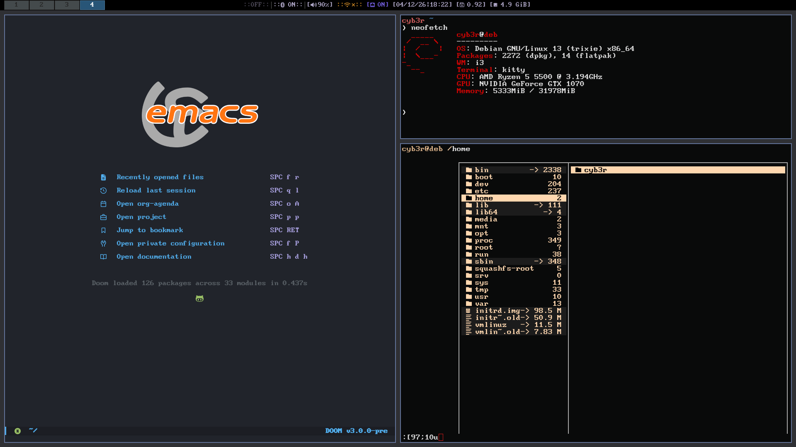

Dot files includes: `i3wm, doom emacs, rofi, ranger, kitty, picom, powermenu, and neofetch.`

!!You need NerdFonts installed to see the icons on i3bar.!! 

For the wrapper.py, you need to store it in any directory of your choice- edit 'config' file to make it work or use the default path in the 'config' file. 
(wrapper.py: ~/.config/i3status)

ex:

